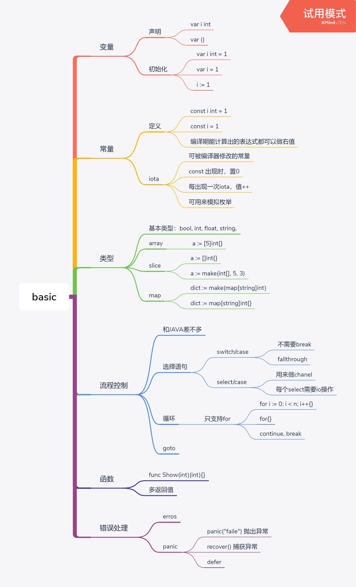
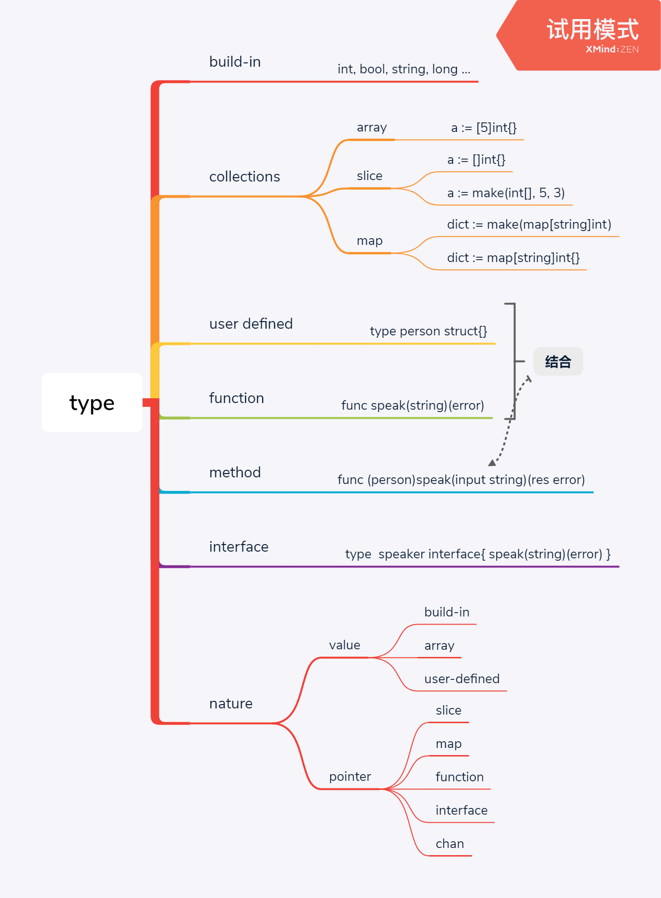

---
layout: default
title: 基础语法
description: golang有别于C和JAVA的地方
date_info: 2019.08.30 成都
---

## 一图流
Go语言的基础语法和java,c很像，这里列出一些有区别的地方


## go的类型
Go语言的对象也分值类型和引用类型
- 在GO语言中，大部分对象是值类型的，如：
    - 原生数据：int, string, bool, long ...
    - 数组
    - struct
- Go语言中的引用类型如下：
    - 切片 slice
    - map
    - chan
    - Go语言中，接口必须使用引用类型



```js
type speaker interface{
        string speak(string)(error)
}

// this is a user define type
type struct Person{
        Name string
}

// this is a method
func(p *Person)speak(word string) error{
        fmt.println(word)
}

// this is a user define type, and inherit Person
type struct Student{
        Person
        class string
}

// this is a function
func main(){
        student := &Student{}
        fmt.println(student.Name)
        student.speak("I'm a student.")
}
```
