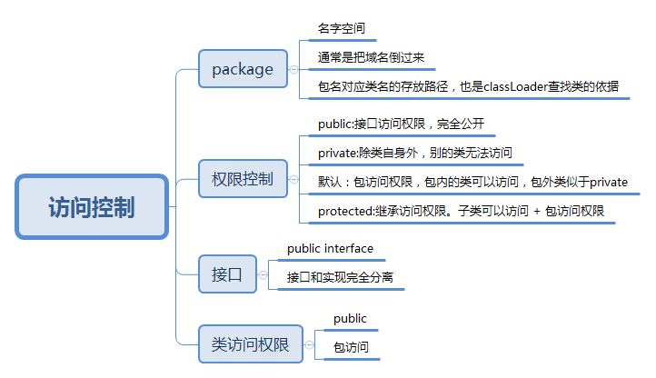

访问控制的目标是为了**隐藏具体实现**：只开放给类库使用者必要的接口，保持这些接口不动。类库提供者可以修改其他代码，以重构，优化功能。

## 一图流



## 包：package

可以把包理解为名字空间，为了让不同开发者提供的类不产生冲突。一般规则是把域名倒过来写，作为包名，class文件在jar包里的存放路径也是按包名作为路径来存放。JVM在加载类的时候，根据classPath找到jar包，再根据包名找到对应的路径，最后根据类名取到class.进行加载。
使用其他包中的类时，用**import**关键字把包导入就可以了，import有两个小特性

* 静态导入一个类，然后就可以直接调用类中的静态方式，而不用加类名，比如：

```java
package com.util;

public class Print {
    public static void println(String s){
        System.out.println(s);
    }
}
```

```java
import static com.util.Print.*

public class TestImport{
    public static void main(String... args){
        println("blog");
    }
}
```

* 实现类似c语言条件编译的效果

其实上面两个特性，用处都不大，知道有这回事就行。

## 权限控制：public,protected,private,package

上面几个关键字为类的域和方法提供了访问权限修饰。

### 包访问权限

在域和方法前没有任何关键字，则为包访问权限。包内的其他类可自由访问此成员(public)。包外的类无法访问（private）。

### public:接口访问权限
可以被任意包下的任意类访问，无限制。

### private:私有
除了类自身的成员，其他类无法访问（即使在同一个包下）。除了接口，和必须暴露实现细节的域，所有域都推荐指定为private。

### protected:继承访问权限
有时候想把某些域开放给子类访问，就可以把域修饰为protected。实际上protected还包含了包访问权限。

