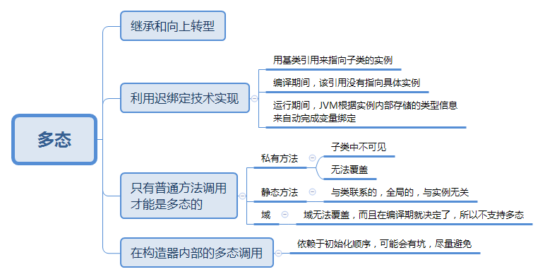

多态伴随着继承和抽象，他不是一个单独的特性，而是类关系全景中的一部分。
> 多态的实现依赖于迟绑定技术。通过迟绑定技术，JVM可以在运行期再决定调用哪个具体的实例，这些实例可以是继承于同一个基类的继承类，因此从实现原理这个角度来看，多态是针对实例的。但从使用者的角度和多态实现的目标来看，我觉得多态是针对的方法的。多态最终是要为同一段代码调用不同实例的方法。正因为如此，那些无法被继承和覆盖的，就无法表现出多态。

## 一图流



## 陷阱

在编码时，我们应该尽量避免在构造器内做太多的工作。尤其是在构造器内调用正在构造的对象本身的动态绑定方法，就有可能会引起一些隐藏的错误。为了展示这个问题，请参考如下代码：

### 代码

```js
package com.kai.ilearn.tij4.ch8.exercise3;

public class Base {

    public Base() {
        System.out.println("Base begin constractor");
        doSomething();
        System.out.println("Base end constractor");
    }

    public void doSomething(){
        System.out.println("Base do sth");
    }
}
```

```js
package com.kai.ilearn.tij4.ch8.exercise3;

public class Sub extends Base {

    private int i;

    public Sub(int i) {
        this.i = i;
        System.out.println("Sub end constractor: " + i);
    }

    @Override
    public void doSomething() {
        System.out.println("Sub do Somthing: " + i);
    }
}
```

```js

package com.kai.ilearn.tij4.ch8.exercise3;

public class TestConstractor {
    public static void main(String[] args) {
        new Sub(47);
    }
}

```

### 执行结果
> 1. Base begin constractor
2. Sub do Somthing: 0
3. Base end constractor
4. Sub end constractor: 47

可能会对第2行的结果值为0有点惊讶，请看下面解析

### 关键步骤解析

> 1. 程序开始，执行Sub.main()方法，首先要加载Sub类，发现Sub类的父类Base，就先加载Base类。接着加载子类Sub。父类和子类都没有静态域，所以加载完成。调用main()方法。期间无打印。new Sub(47)时，发现父类，先分配父类空间，执行父类普通域初始化(无)。调用父类构造器。打印LINE 1。
2. 在构造器中调用了doSomething()方法，此方法被子类Sub()重载，因此调用子类的doSomthing()方法。子类的方法中会打印i的值。i是在子类的构造方法中才赋值的，此处为初始化值，因此LINE2打印为0.
3. 父类构造结束，打印LINE3。
4. 接着构造子类，此时i被赋值为47.

多态这部分整体比较简单，等以后从JVM层面再深入分析一下他的实现吧。