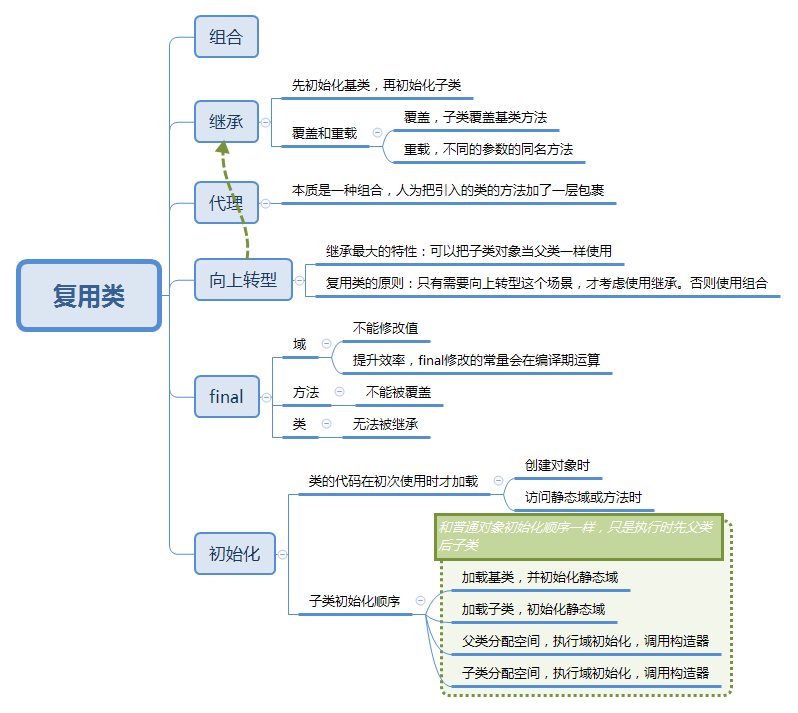

复用代码是Java最重要的功能，主要有组合和继承两种方式 。

## 一图流



## 继承类的初始化顺序

继承类的初始化顺序比较容易弄混，其实和普通对象的初始化顺序是类似的，只是需要遵循先父后子的原则。普通对象的初始化顺序可以参考[初始化与清除](gc.html)中，初始化那个节点的图。为了展示这个特性，我做了实验。
### 代码

```js
package com.kai.ilearn.tij4.ch7;

public class Base {

    public static int getInt(String s, int i) {
        System.out.println(s);
        return i;
    }

    static int i = getInt("base static field", 11);
    int j = getInt("base normal field", 12);

    public Base() {
        System.out.println("constractor base");
    }
}
```

```js
package com.kai.ilearn.tij4.ch7;

public class Sub extends Base {
    public Sub() {
        System.out.println("constractor sub");
    }

    static int j = getInt("sub static field", 21);
    int k = getInt("sub normal field", 22);

    public static void main(String[] args) {
        System.out.println("begine test!--");
        new Sub();
    }
}
```

### 执行结果
> 1. base static field
2. sub static field
3. begine test!--
4. base normal field
5. constractor base
6. sub normal field
7. constractor sub

### 关键步骤解析
> 1. 程序开始，执行Sub.main()方法，首先要加载Sub类，发现Sub类的父类Base，就先加载Base类。打印1
2. 接着加载子类Sub。打印2
3. 加载完毕，调用main()方法，打印3
4. new Sub()时，发现父类，先分配父类空间，执行父类普通域初始化，调用父类构造器。打印4.5。**注意：分配空间，初始化普通域，调用构造器是绑定在一起的**
5. 分配子类空间，初始化子类域，调用子类构造器。打印6.7