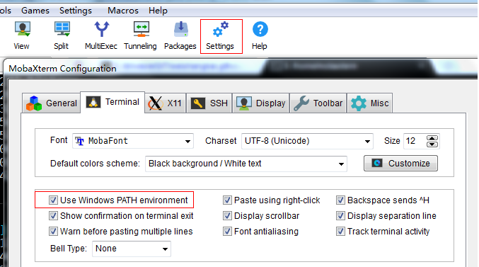

## Mobaxterm

如何在没有Linux主机的场景下学习shell? 或者单纯想在windows上使用bash, Vim, sed, awk，unzip这些工具怎么办？ win10推出了Bash on windows，这个工具我没有使用过，我自己是在电脑上安装了Mobaxterm来实现的。在这儿介绍一下强大的Mobaxterm。

### Tips

1. **Mobaxterm** 作为一款非常好用的linux远程桌面工具，非常好用，是大多数人的必备工具。
2. Mobaxterm 本身集成了一套基本款的**cygwin**。有很多bash命令被支持。
3. Mobaxterm 增加了对cygwin 的扩展支持，可以直接在终端安装cygwin软件包，假设包名为"man"，安装命令如下：
  ```
	apt-cyg install man
  ```
4. 在Mobaxterm的设置中勾选使用windows环境变量，可以继承windows环境变更。之后可以用Mobaxterm来替代cmd工作，也可以替代Git Bash工作。一个IDE搞定一切。

  