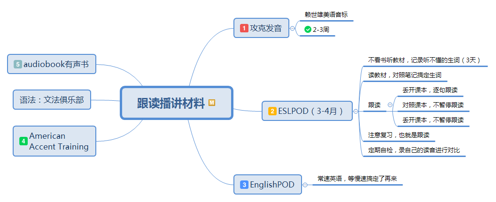

读了恶魔奶爸《把你的英语用起来》这本书，觉得很不错，整理了一个读书笔记。话说我的博客基本就是读书笔记了。

# 概览
>包含了学习英语的思路与方法，以及这本书的原则，介绍了二义习得理论，我觉得这是此书最有价值的部分

# 跟读播讲类材料

>通过跟读播讲类材料提升英语能力，从学习方法到教材难度递进都很讲究，值得认真学习

# 透析英语原著
>用透析法学习英语原著的方法。通过阅读原著来学习英语应该是靠谱的方法。但是此书这部分鸡汤太多，使用方法也显得有些做作，像传销的感觉。

