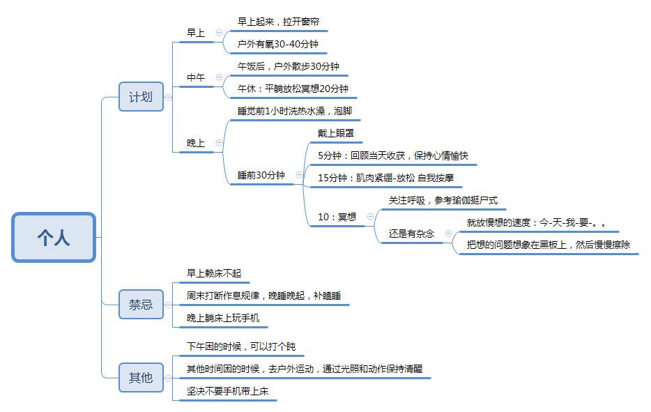

由于工作性质问题，作息不规律导致睡眠质量不高。因此查了些科学睡眠的知识。做一个整理和计划，重在执行。

## 神奇的睡眠

[Kacper M. Postawski](http://powerfulsleep.com/) 写的一本书。书中提出睡眠最核心的是**_体温周期_**：在体温下降的过程，人会有困意。体温上升的过程，人会保持清醒和活力。而影响体温周期的核心要素是**_光照_**和**_运动_**。

## 睡眠十律

BBC制作的一个记录片，关于高质量睡眠的十件事。可以在B站上看到免费完整版。

## 计划

看完之后，发现《神奇的睡眠》和《睡眠十律》很多方面都是相通的，结合网友经验，制订了一个睡眠计划，重在执行。

