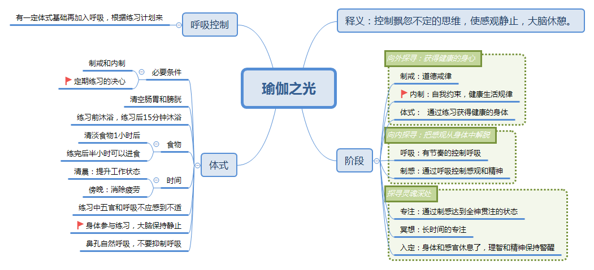

一直在断断续续的练习瑜伽。没有报培训班，主要是根据艾扬格先生的《瑜伽之光》做为教材来自学。虽然没有坚持的很好，但是就这些断断续续的练习已经使我受益非常多了。

## 笔记
练习体式之余，对瑜伽的思想和练习时的注意事项做了一个笔记。方便自己随时查阅。最终的目标是能理解这些思想，并且把注意事项融入平时的练习中，但是我现在是做不到的，所以只能做笔记。随时反思改正。

## 个人体会
* 练习之前需要做好心理准备，抽出足够的时间，放松心态来练习
* 关于进度，《瑜伽之光》里已经有详细的练习计划。练习的时候不要急着去升到更高难度的动作。也不必要完全遵循《瑜伽之光》里的计划，即使我们的练习进度比书中慢一倍，也能在6年内完成《瑜伽之光》的训练计划。真正有决心的练习者应该是用一生的时间来练习瑜伽的。我始终觉得只要一个动作还能给身体带来益处，就可以练下去，永远不要追赶进度。