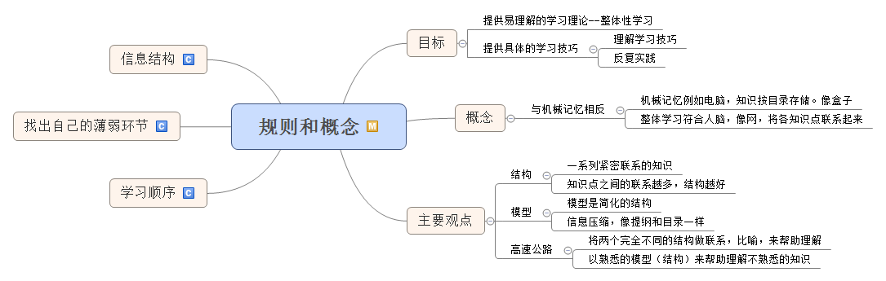
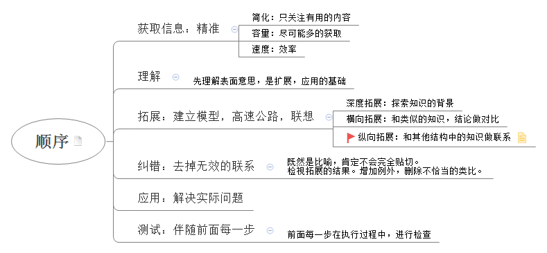
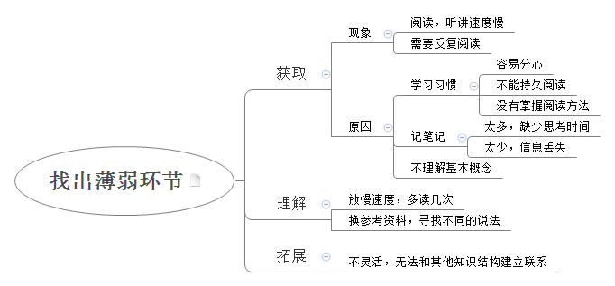
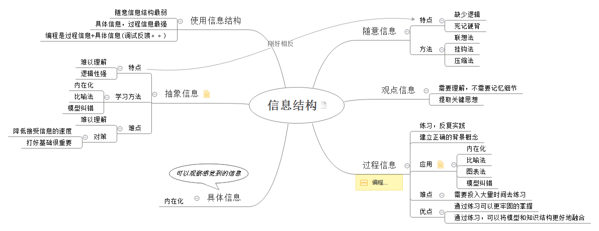
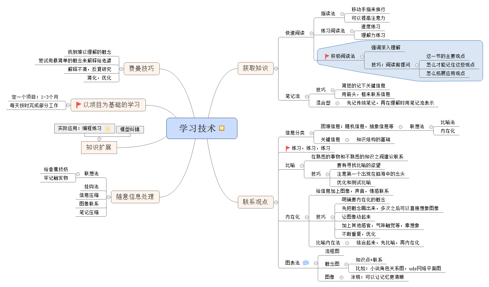
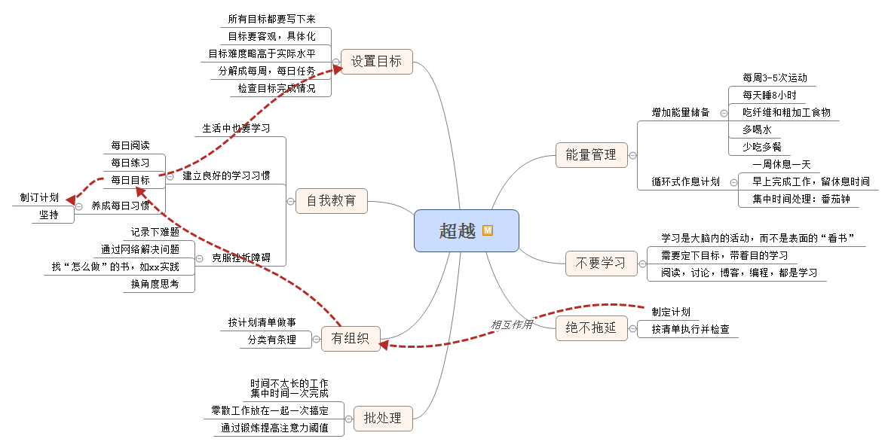

斯科特·扬在家用了12个月，通过互联网完成了四年麻省理工大学33门的计算机课程。《如何高效学习》是他对学习方法的一个总结。我看的是中文版，原版书名为《learn more study less》，我觉得原版书名更能突显此书的核心，所以用它作为博客标题。

这本书是一本行动指南，需要反复翻阅和实践，才能真正掌握这些学习的技术。因此我把书的主要部分总结成思维导图。算是一个读书笔记以供自己复习和理解，避免了翻阅原书而花费太多时间。

# 规则和概念

### 主要观点

> * 整体学习最最要的概念就是整体性，知识点之间应该是联系越多，掌握的越牢固。当我们为知道点建立了千丝万缕的关系后，就可以轻松的通过一条线索牵扯出大量的知识。`在需要时能够被快速提取的知识，才是真正的知识`，这一点在解决实际问题时尤为重要。
> 
* 学习的目标是把知识运用到实际中去，这也是知识最好的联系。如果能在实际工作中运用到知识，那对知识的理解和掌握必定更加深刻。比如学python，就可以写一些小工具。学网络，就可以抓包分析，进行网络配置。

### 学习顺序

> 整体学习的学习顺序如下图所示，但这并不是一成不变的线性顺序。步骤之间可以往返，也可以跳跃，可以理解之后马上应用，也可以拓展之后帮助深入理解。学习顺序本身也是一张网。 

### 找出自己薄弱环节

> 要改进学习方法，需要明确薄弱环节在哪里。下图帮助自己找到弱点。

### 信息结构

> 此节最重要的是为信息分类，这样才能为不同信息对应不同的学习方法。拿软件开发来说，搭建一个框架，或者开发一个特性，这是过程化信息，更多的是需要实践和练习。但是计算机底层构造，内存模型，资源调度这属于抽象知识，需要的是深入理解以及打好基础才能掌握。

# 学习技术
> * 学习技术中获取知识的积极阅读法很重要，它是深入掌握知识的必经之路。笔记流刚好符合我用思维导图来记笔记的习惯。通过思维导图记录关键信息，然后为关键信息之前建立联系。
> * 在拓展知识点时，需要识别困难信息和关键信息，对这些信息采用联想法加深记忆和理解，其余信息则不用。这种学习方法要通过反复的练习才可以掌握。
> * 以项目为基础的学习，也是一个非常重要的技巧，在学习编程技术时可以使用这种技术。比如我想学python和AI，就计划一个3个月的目标，做了个独立的项目。

# 自我超越

> 此节也非常重要，可以说每一节都非常重要。尤其是能量管理和计划组织方面。
> * 能量管理中提到的方法和策略，我在多本书中看到过，不限于学习知识，也包括健身等生活各方面。是具体战术。
> * 看我的红线，计划一词贯穿整个流程，它能提高执行力和效率，并且针对拖延症是很好的药方。是战略级的。制订合理的目标和计划，并坚决执行，是一切的关键。

图是以前画的，很高兴在整理博客时，发现自己已经可以加入一些自己的观点了，说明多少是有一些理解和应用的。
对照原著看了一下，发现的思维导图中的笔记已经涵盖了原书中所有重要内容。以后不用再翻原书了，只靠博客就能回想起原书的内容了。

对着导图，在大脑里给图加上细节和想法，给自己看。这样才能把内容变成自己的。任何的书，知识体系，都是一幅图。有了图，书只是注解。